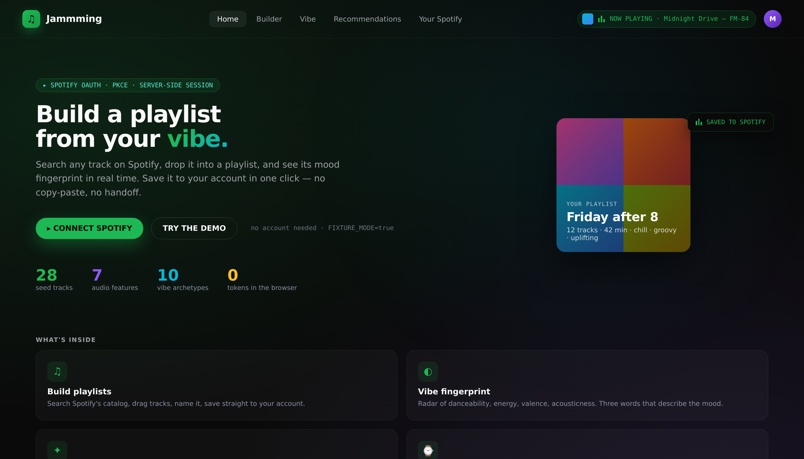
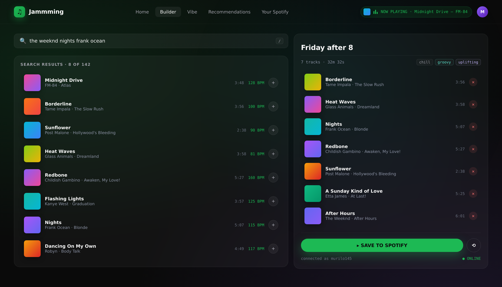
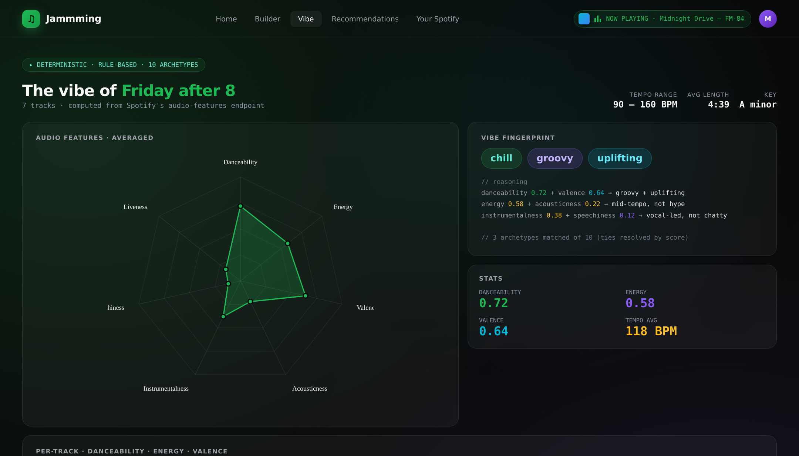
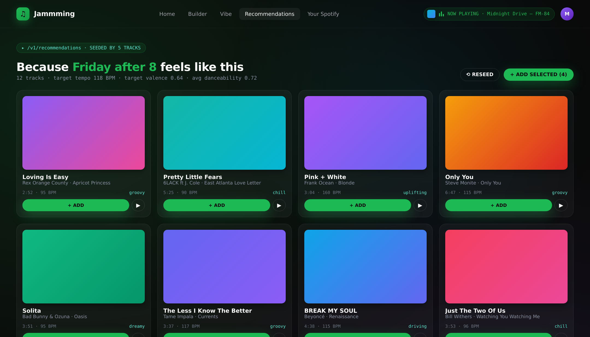
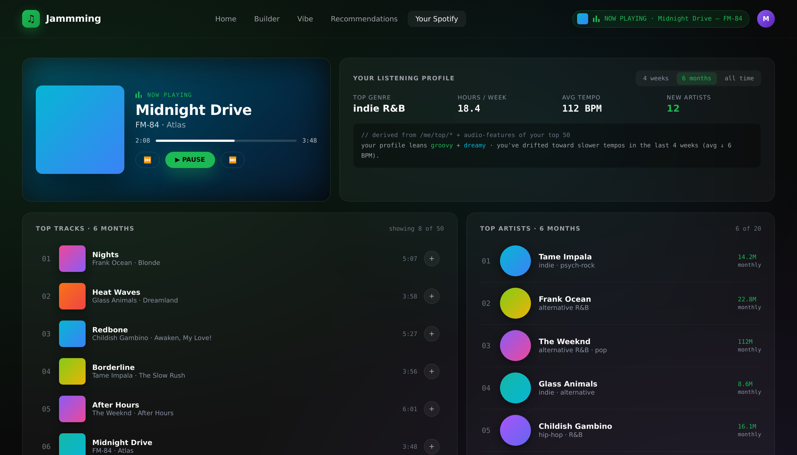
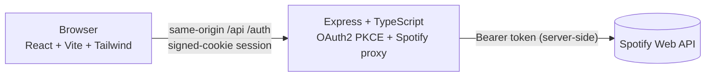

# Jamming — build Spotify playlists from your vibe

<p>
  
  
  
  
  
  
  
</p>

Jamming is a Spotify playlist builder rebuilt from the ground up as a portfolio piece. It goes well beyond the classic "search + save" exercise: it visualizes the **audio-features fingerprint** of the playlist you're assembling, labels it with a three-word vibe (`chill · focus · uplifting`, `hype · driving · groovy`, …), seeds Spotify's recommendation engine with your current tracks, shows what you're playing right now, and ships your finished playlist back to your Spotify account with one click.

> Built with React 18 + Vite + TailwindCSS on the front and Node 20 + Express + TypeScript on the back. Full OAuth2 PKCE flow is handled server-side — the browser never sees a Spotify access or refresh token.

## Screenshots

| | |
|---|---|
|  |  |
|  |  |
|  | |

## Features

- **Search + build** — type-ahead search over Spotify's catalog, drop tracks into a side-by-side playlist panel.
- **Vibe fingerprint** — the backend averages the audio features of your playlist and labels it using a deterministic rule engine (no LLM, reproducible, unit-tested).
- **Radar chart** of danceability / energy / valence / acousticness / instrumentalness / speechiness for the whole playlist, plus per-track sparklines.
- **Recommendations** seeded by your top five tracks via `/v1/recommendations`, with bulk "add all" / "add selected" actions.
- **Your top tracks + artists** across `short_term` / `medium_term` / `long_term` windows, with a tabbed toggle.
- **Now-playing indicator** with blurred cover background and an animated 3-bar equalizer.
- **Save to Spotify** — creates the playlist and adds every track in one atomic flow (batched at 100 URIs per Spotify's limit).
- **Fixture mode** — set `SPOTIFY_FIXTURE_MODE=true` and the app runs end-to-end with ~30 pre-baked tracks across 6 genres, no Spotify developer account required.

## Architecture



Full architecture and PKCE sequence diagram: [`docs/architecture.md`](docs/architecture.md).

## Quick start — fixture mode (no Spotify account needed)

```bash
# backend
cd backend
cp .env.example .env
# .env already has SPOTIFY_FIXTURE_MODE=true
npm install
npm run dev    # :8787

# frontend (separate terminal)
cd ../frontend
cp .env.example .env
npm install
npm run dev    # :5173 — Vite proxies /api and /auth to :8787
```

Open <http://localhost:5173> and click **Try demo**. No real Spotify traffic is made.

## Quick start — real Spotify (dev app)

1. Create a Spotify developer app at <https://developer.spotify.com/dashboard>.
2. Add `http://localhost:8787/auth/callback` as a **Redirect URI**.
3. Copy the Client ID into `backend/.env`, and set `SPOTIFY_FIXTURE_MODE=false`.
4. Generate a strong session secret: `openssl rand -hex 32` → `SESSION_SECRET` in `backend/.env`.
5. `cd backend && npm run dev`, `cd frontend && npm run dev` as above.
6. Click **Connect Spotify**, authorize, you're in.

## Environment variables

### Backend (`backend/.env`)

| Var | Required | Default | Notes |
|---|---|---|---|
| `PORT` | no | `8787` | HTTP port |
| `NODE_ENV` | no | `development` | toggles secure cookies, Morgan |
| `CORS_ORIGIN` | yes | `http://localhost:5173` | comma-separated allow-list |
| `SESSION_SECRET` | yes | — | ≥16 chars; HMAC key for signed sid cookies |
| `SPOTIFY_CLIENT_ID` | when live | — | from the Spotify dashboard |
| `SPOTIFY_REDIRECT_URI` | when live | `http://localhost:8787/auth/callback` | must match the dashboard entry verbatim |
| `SPOTIFY_SCOPES` | no | see `.env.example` | space-separated |
| `FRONTEND_POST_LOGIN_URL` | no | `http://localhost:5173/app` | redirect target after OAuth callback |
| `SPOTIFY_FIXTURE_MODE` | no | `true` | when `true`, OAuth + API calls are stubbed |
| `CACHE_TTL_SECONDS` | no | `90` | in-memory TTL for hot responses |

### Frontend (`frontend/.env`)

| Var | Required | Default | Notes |
|---|---|---|---|
| `VITE_BACKEND_URL` | dev only | `http://localhost:8787` | Vite proxy target for `/api` + `/auth` |

## API reference

All responses are JSON. Authenticated routes require the signed session cookie (set by the OAuth callback or by the fixture-mode shortcut in `GET /auth/login`).

### Auth

| Method | Path | Description |
|---|---|---|
| `GET` | `/auth/login` | Starts PKCE. Returns `{ authUrl, state }` (live) or `{ mode: 'fixture', redirectTo }` (fixtures). |
| `GET` | `/auth/callback?code&state` | Exchanges the authorization code for tokens, sets the session cookie, redirects to the frontend. |
| `POST` | `/auth/refresh` | Manually refreshes the access token. Usually not needed — the backend auto-refreshes. |
| `POST` | `/auth/logout` | Destroys the session, clears the cookie. |
| `GET` | `/auth/status` | `{ authenticated, fixtureMode }`. |

### Data

| Method | Path | Description |
|---|---|---|
| `GET` | `/api/health` | Liveness probe. |
| `GET` | `/api/me` | Current user profile. |
| `GET` | `/api/search?q=&limit=` | Search tracks. |
| `POST` | `/api/audio-features` | Body `{ ids: string[] }` → audio features for those track ids. |
| `GET` | `/api/recommendations?seed_tracks=&limit=` | Recs seeded by 1–5 track ids. |
| `GET` | `/api/me/top/tracks?time_range=` | `short_term` / `medium_term` / `long_term`. |
| `GET` | `/api/me/top/artists?time_range=` | ditto. |
| `GET` | `/api/me/currently-playing` | The user's current player state. |
| `POST` | `/api/playlists` | Body `{ name, description, trackIds }` → creates the playlist + adds tracks. |
| `POST` | `/api/vibe` | Body `{ audioFeatures: [...] }` → rule-based vibe fingerprint. |

## Deployment

- Images build out of the box: `docker compose up --build`.
- For tagged releases, `.github/workflows/deploy.yml` pushes versioned images to GHCR (`ghcr.io/<owner>/jamming-backend`, `ghcr.io/<owner>/jamming-frontend`).
- The frontend image is a minimal Nginx serving the Vite static build with an SPA fallback and a backend reverse-proxy baked into the `nginx.conf`.
- CI runs `tsc --noEmit`, `vitest`, and `vite build` on both packages in a Node 20 matrix.

## Security notes

- **PKCE (no client secret in git).** OAuth2 authorization code with PKCE means the code verifier lives on the backend only, and the client secret never needs to exist.
- **Refresh token never reaches the browser.** The backend stores access + refresh tokens in a server-side session keyed by a signed cookie.
- **HMAC-SHA256 signed session cookies.** Tampering is rejected via constant-time comparison. `HttpOnly`, `SameSite=Lax`, `Secure` in production.
- **Strict CORS allow-list** driven by `CORS_ORIGIN`.
- **Rate limiting** on both the global API (240/min) and the auth endpoints (30/min).
- **Zod validation** on every request body and query — typed, rejects malformed input with 400.
- **No `any` in the codebase.** Strict TypeScript everywhere, both packages clean under `tsc --noEmit`.

## Project layout

```
backend/
  src/
    routes/         # auth.ts, api.ts — Express routers with zod validation
    services/       # spotify client, vibe engine, session store, cache, fixtures
    middleware/     # CORS allow-list, request id, session hydrator, error handler
    __tests__/      # vitest — vibe, fixtures, cache, session
  Dockerfile, tsconfig.json, vitest.config.ts, .env.example
frontend/
  src/
    pages/          # Landing, Builder, Vibe, Recommendations, Me
    components/     # Header, PlaylistBoard, RadarChart, NowPlayingChip, …
    lib/            # api.ts, types.ts
    store/          # zustand playlist store
  Dockerfile, nginx.conf, vite.config.ts, tailwind.config.js
docs/
  architecture.md
.github/
  workflows/ci.yml, deploy.yml
docker-compose.yml
```

## License

MIT.
