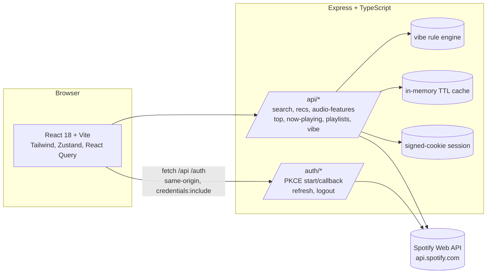

# Architecture

Jamming is a two-tier app — a Vite+React frontend talking to an Express+TypeScript backend that brokers every Spotify Web API call. The browser never sees a Spotify access or refresh token; the backend owns both and the browser holds only an HMAC-signed session cookie keyed to an in-memory session record.

## High-level diagram



Everything the browser sends is same-origin (Vite dev proxies `/api` and `/auth` to the backend; in production, Nginx does the same). CORS is configured with a strict allow-list — the backend only accepts browser calls from `CORS_ORIGIN`.

## OAuth2 PKCE flow

```mermaid
sequenceDiagram
  autonumber
  participant B as Browser
  participant API as Backend
  participant SA as Spotify Accounts
  participant SW as Spotify Web API

  B->>API: GET /auth/login
  API->>API: generate code_verifier, code_challenge, state
  API-->>B: { authUrl, state }
  B->>SA: redirect to authUrl (client_id, S256 challenge)
  SA-->>B: user consents, redirect to /auth/callback?code,state
  B->>API: GET /auth/callback?code&state
  API->>SA: POST /api/token (code + code_verifier)
  SA-->>API: access_token, refresh_token, expires_in
  API->>API: create session, store tokens in-memory
  API-->>B: Set-Cookie: jamming_sid=<signed sid>; HttpOnly; SameSite=Lax
  API-->>B: 302 -> FRONTEND_POST_LOGIN_URL

  B->>API: GET /api/search?q=...
  API->>API: verify signed session, load tokens
  API->>SW: GET /v1/search with Bearer token
  SW-->>API: tracks
  API-->>B: normalized payload (no tokens ever leave)
```

The refresh flow is mostly automatic: every authenticated request checks the session's `expiresAt` and proactively refreshes if we're within 30 seconds of expiry. A 401 from upstream also triggers one reactive refresh + retry.

## Why PKCE over Authorization Code with a client secret?

- **No client secret in the code base.** Spotify's PKCE path lets a "public" client prove it started the flow using a one-time code verifier, which never crosses the network in cleartext.
- **Same flow works in dev and prod.** No distinct "native app" vs "web app" secrets.
- **Refresh tokens still come back server-side.** The browser is never trusted with them; they live in the backend's session store, scoped to a signed cookie.

## Caching strategy

The backend keeps a tiny TTL cache (default 90s) for search, audio-features, recommendations, and top tracks/artists. Keys include the query parameters so a user rapidly paging through searches doesn't batter the Spotify rate limiter. Cache is per-process in-memory — stateless enough to horizontally scale behind sticky sessions, and trivially swappable for Redis.

## Fixture mode

`SPOTIFY_FIXTURE_MODE=true` short-circuits both OAuth and every upstream call, substituting the baked-in data in `backend/src/services/fixtures.ts`. This is how the portfolio deploys without needing a Spotify developer account to exercise.
